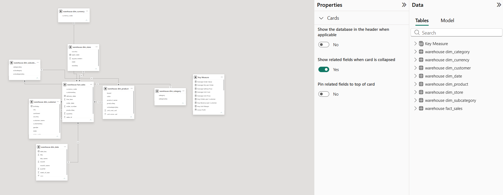
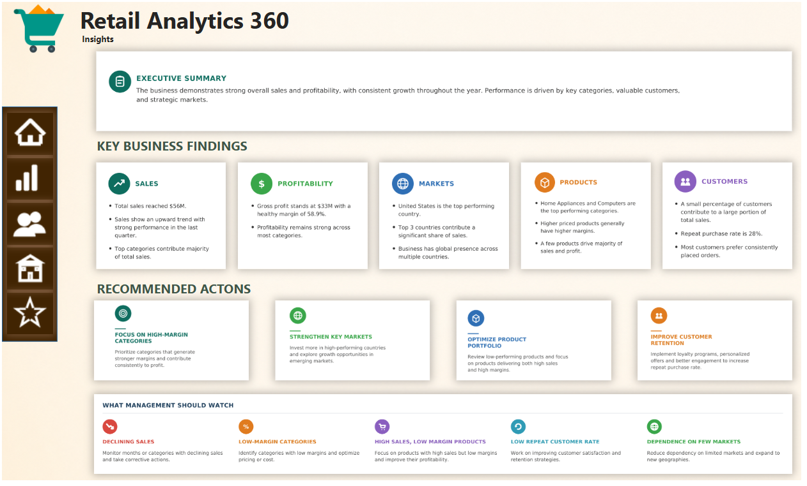

# 📊 Retail Analytics 360

An end-to-end **Retail Analytics project built using SQL and Microsoft Power BI**, focused on understanding sales, customers, products, profitability, and overall business performance.

---

## 🔗 Live Dashboard

👉 **[View Live Power BI Dashboard](https://app.powerbi.com/view?r=eyJrIjoiODU2OTFjYTktM2JjZS00ZjI3LWJjY2EtMmRjNTVlZWU1YzI4IiwidCI6ImM2ZTU0OWIzLTVmNDUtNDAzMi1hYWU5LWQ0MjQ0ZGM1YjJjNCJ9)**

---

## 📌 Project Overview

Retail businesses generate a large amount of sales, customer, product, and store data, making it difficult to understand overall business performance.

The goal of this project was to clean and organize the raw retail data, build a structured data model, and create an interactive Power BI dashboard that brings important business insights together in one place.

---

## 🎯 Problem Statement

Retail businesses generate a large amount of sales, customer, and product data, making it difficult to understand overall business performance. This project aims to bring this data together into one interactive dashboard to easily track sales, customers, products, and key business trends.

---

## 💡 Solution

I built a Power BI dashboard using the raw CSV data. I cleaned and organized the data, created a data model, and developed five interactive pages to analyze sales, customers, products, and overall business performance.

---

## 📂 Dataset

**Source:** Maven Analytics  
**Dataset:** Global Electronics Retailer

The dataset contains information related to:

- Sales transactions
- Products
- Customers
- Stores
- Categories
- Subcategories
- Dates
- Currency

The original raw CSV files are included in the `data/raw` folder.

---

## 🧹 Data Cleaning & Preparation

Before building the dashboard, the raw data was cleaned and prepared for analysis.

The main steps included:

- Checking missing values
- Checking duplicate records
- Correcting data types
- Standardizing fields and keys
- Checking data consistency
- Preparing tables for data modelling
- Creating required calculated measures

---

## 🗄️ SQL Data Modelling

Once the raw data was cleaned, I used SQL to build the data model.

I created a central **Fact Sales** table and multiple **Dimension tables**, and connected them using the required relationships.

The main dimension tables include:

- Customer
- Product
- Category
- Subcategory
- Store
- Date
- Currency

---

## ❄️ Snowflake Schema

The project uses a **Snowflake Schema**.

The `Fact Sales` table acts as the central table, while related dimension tables provide information about customers, products, stores, dates, categories, subcategories, and currencies.

Product-related information is further divided into **Product → Subcategory → Category**, creating the normalized structure of the Snowflake Schema.

### Data Model



---

## 🛠️ Tools & Technologies

- **Microsoft Power BI**
- **SQL**
- **Power Query**
- **DAX**
- **Data Modelling**
- **Data Visualization**

---

# 📊 Dashboard

The dashboard contains five main analytical sections.

---

# 1. 📈 Executive Overview

The Executive Overview provides a high-level view of overall business performance.

### Key KPIs

| KPI | Value |
|---|---:|
| Total Sales | $56M |
| Gross Profit | $33M |
| Total Orders | 26K |
| Total Customers | 12K |
| Profit Margin | 59% |

### Analysis Includes

- Sales Trend Over Time
- Sales by Category
- Sales by Country
- Sales vs Profit by Month

### Key Finding

**Computers are the leading category, while the United States is the top-performing country by sales.**


---

# 2. 💰 Sales Analysis

The Sales Analysis page focuses on sales and order performance.

### Key KPIs

| KPI | Value |
|---|---:|
| Average Selling Price | $282 |
| Average Order Value | $2.12K |
| Quantity Sold | 198K |
| Average Quantity per Order | 7.51 |
| Total Sales | $56M |

### Analysis Includes

- Top 10 Products by Sales
- Sales by Subcategory
- Top Brands by Sales
- Quantity Sold by Category

### Key Finding

**Desktops are the top-selling subcategory, while Adventure Works is the leading brand by sales.**


---

# 3. 👥 Customer Analysis

The Customer Analysis page focuses on customer size, behaviour, and purchasing patterns.

### Key KPIs

| KPI | Value |
|---|---:|
| Total Customers | 12K |
| Repeat Customers | 7K |
| Repeat Rate | 61.2% |
| Average Revenue per Customer | $4.69K |
| Average Orders per Customer | 2.21 |

### Analysis Includes

- Customer Base by Country
- Customers by Gender
- Customer Share by Continent
- Average Orders per Customer by Country

### Key Finding

**The United States has the largest customer base, while repeat customers represent an important part of the customer base.**


---

# 4. 📦 Product Analysis

The Product Analysis page focuses on the product portfolio, pricing, costs, and margins.

### Key KPIs

| KPI | Value |
|---|---:|
| Total Products | 2K |
| Average Unit Price | $357 |
| Average Unit Cost | $148 |
| Average Selling Price | $282 |
| Average Unit Margin | $209 |

### Analysis Includes

- Product Portfolio by Category
- Unit Price vs Unit Cost by Category
- Product Price vs Unit Margin
- Top Subcategories by Product Count

### Key Finding

**Home Appliances and Computers have the largest product range, while higher-priced products generally show higher unit margins.**


---

# 5. ⭐ Insights & Recommendations

The final page summarizes the main findings from the analysis and converts them into business recommendations.

### Key Business Findings

- Strong overall sales and profitability
- United States is the leading market
- Major categories contribute a large share of sales
- Home Appliances and Computers have a large product presence
- Repeat customers form an important part of the customer base

### Recommended Actions

- **Focus on High-Margin Categories**  
  Prioritize categories that generate stronger margins and contribute consistently to profit.

- **Strengthen Key Markets**  
  Invest more in high-performing countries while exploring opportunities in emerging markets.

- **Optimize Product Portfolio**  
  Review low-performing products and focus on products that combine strong sales with healthy margins.

- **Improve Customer Retention**  
  Use loyalty programs, personalized offers, and better customer experiences to increase repeat purchases.



---

# 🔎 Interactive Features

The dashboard is fully interactive and allows users to explore the data using:

- Year
- Quarter
- Month
- Country
- State
- Category
- Subcategory
- Brand
- Store

A **Reset Filters** button is also available to quickly return the dashboard to its default view.

---

# 💡 Key Takeaways

The project provides a complete view of the retail business by connecting:

**Sales → Customers → Products → Markets → Profitability**

The dashboard helps users:

- Identify high-performing categories
- Find top-selling products and brands
- Understand customer behaviour
- Compare market performance
- Evaluate product pricing and margins
- Identify opportunities to improve profitability
- Improve customer retention

---

# 👨‍💻 Author

## Shubh Srivastava

**M.Sc. Statistics | Data Analytics Enthusiast**

### Skills

**Power BI • SQL • DAX • Power Query • Data Modelling • Data Visualization • Data Cleaning**

### Connect With Me

📧 **Email:** [shubh200405@gmail.com](mailto:shubh200405@gmail.com)

🔗 **LinkedIn:** [Shubh Srivastava](https://www.linkedin.com/in/shubh-srivastava-0710593b2/)

🐙 **GitHub:** [shubh200405-coder](https://github.com/shubh200405-coder)

---

## ⭐ Project

If you find this project useful, feel free to explore the repository and the live dashboard.

**[🚀 View Live Power BI Dashboard](https://app.powerbi.com/view?r=eyJrIjoiODU2OTFjYTktM2JjZS00ZjI3LWJjY2EtMmRjNTVlZWU1YzI4IiwidCI6ImM2ZTU0OWIzLTVmNDUtNDAzMi1hYWU5LWQ0MjQ0ZGM1YjJjNCJ9)** 

# 📁 Repository Structure

```text
Retail-Analytics-360/
│
├── assets/
│   ├── model.png
│   ├── executive overview.png
│   ├── sale analysis.png
│   ├── customers analysis.png
│   ├── products analysis.png
│   └── insights.png
│
├── data/
│   └── raw/
│       └── Maven Analytics CSV Files
│
├── report/
│   └── Project Report / Presentation
│
├── README.md
└── Retail_Analytics_360.pbix
